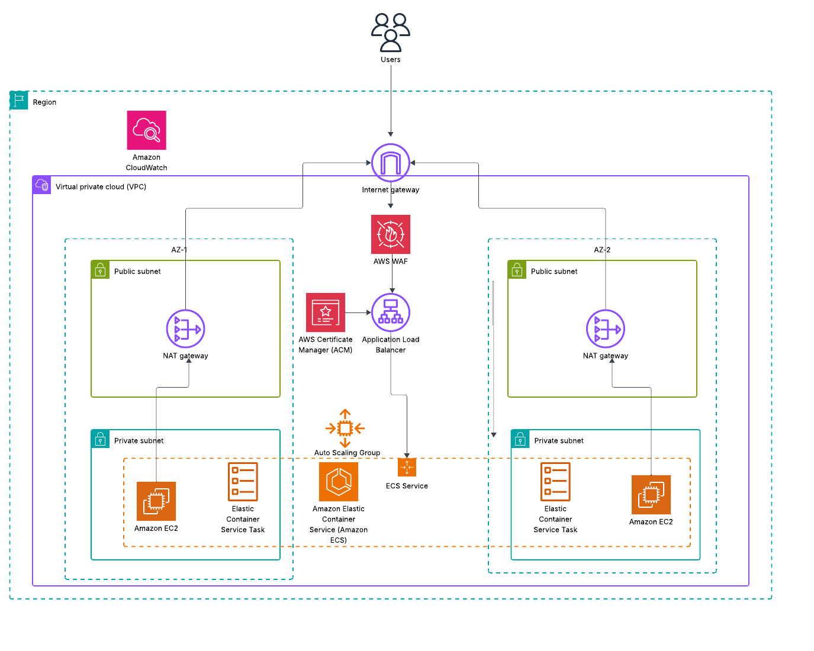

# Highly Available & Auto-Scaling Containerized Application Deployment on AWS

 

This repository contains the documentation and architecture for a Capstone project demonstrating a resilient, scalable, and secure hosting platform on AWS for containerized applications.

 

The architecture was validated by deploying a containerized PICO-8 web game, proving its ability to handle variable traffic, scale automatically, and withstand component failure.

 

---

 

## Architecture Diagram

 

 

---

---

## Functioning Website

![Website] (https://blake-projects.com)

 

## Key Features

 

- **High Availability:** Deployed across multiple AWS Availability Zones to ensure resilience against single-zone failures.

- **Automatic Scaling:** The application automatically scales based on CPU load, ensuring performance during traffic spikes and cost savings during quiet periods.

- **Secure Networking:** A two-tier design with public subnets for the load balancer and private subnets for the application instances, minimizing the attack surface.

- **Web Application Firewall (WAF):** Protects the application from common web exploits like SQL injection and cross-site scripting.

 

---

 

## Core Services Used

 

- **Amazon ECS on EC2:** For container orchestration.

- **Application Load Balancer (ALB):** To distribute incoming traffic.

- **AWS WAF & ACM:** For security and SSL/TLS encryption.

- **Amazon CloudWatch:** For logging and monitoring.

- **EC2 Auto Scaling Group:** To manage the fleet of underlying compute instances.